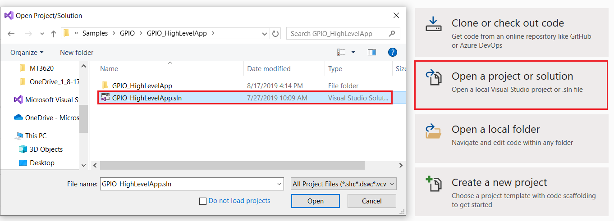
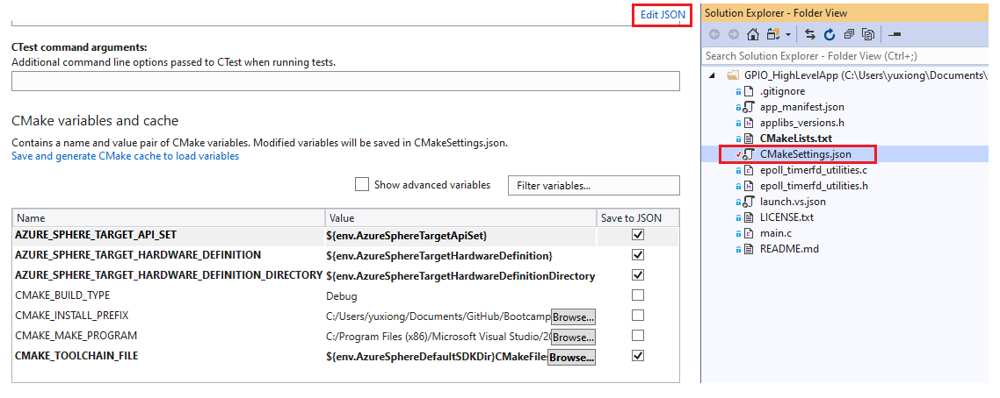
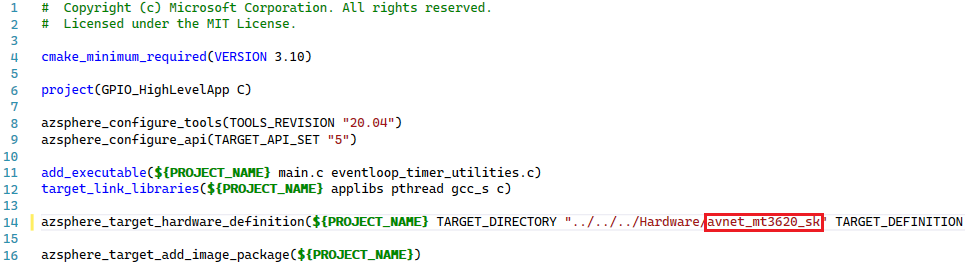
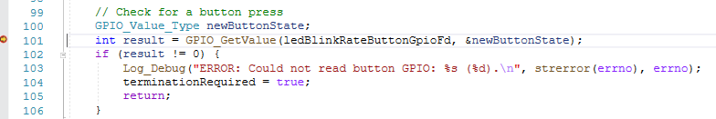

# Lab-1: Blinking LED

- Go to [Home Page](README.md)

## Goals

- Understand the basic sketch of Azure Sphere High-level Applicaiton
- Leann how to build & debug Application using Visual Studio
- Learn how to use GPIO API from Azure Sphere SDK

## Steps

1. Enable device debug and disable OTA in Azure Sphere utility
   
   `azsphere device enable-development`

2. Clone Official Azure Sphere Samples repo

    `git clone https://github.com/Azure/azure-sphere-samples`

3. Open a local folder in Visual Studio and navigate to the folder of *.\azure-sphere-samples\Samples\GPIO\GPIO_HighLevelApp*, click **Select Folder** to open the CMake project.
   
    

4. **(Optional)** If you're using AVNET_MT3620_SK, there're addtional modifications required since official sample code are based on MT3620_RDB board. Azure Sphere OS use[hardware definition file](https://docs.microsoft.com/en-us/azure-sphere/app-development/manage-hardware-dependencies) to abstract hardware. Double click CMakeSettings.json file in Solution Explorer, a 'CMake Settings' page will pop, click **Edit JSON** to edit it. 
    
    

    Change the value of AzureSphereTargetHardwareDefinitionDirectory to avnet_mt3620_sk and save (CTRL+S). A CMake cache generation process will start and complete soon with `'1> CMake generation finished.'` message display at the end. 

    

5. Select **GDB Debugger (HLCore)** as debug target and press **F5** to start build and load target application onto device for debugging. 
   
   

6. RED LED start to blink after Application is loaded. Press **Button A** will change the blinking rate. Both LED and Button A are connected to GPIO pin and controlled by the high-level Application.

7. Select Line 82 and press **F9** to set a breakpoint on function *GPIO_SetValue*, you will see the program is halt and stop on this line. Continue with **F5** and now you can control the ON/OFF state of LED.

 

## Read more
- [Using GPIOs on Azure Sphere](https://docs.microsoft.com/en-us/azure-sphere/app-development/gpio)
- [Best practices for high-level Application](https://docs.microsoft.com/en-us/azure-sphere/app-development/initialization-termination)
- [Manage target hardware dependencies](https://docs.microsoft.com/en-us/azure-sphere/app-development/manage-hardware-dependencies)

