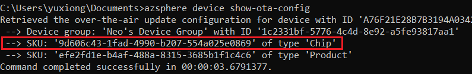
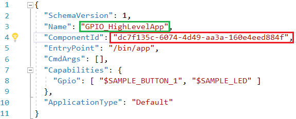
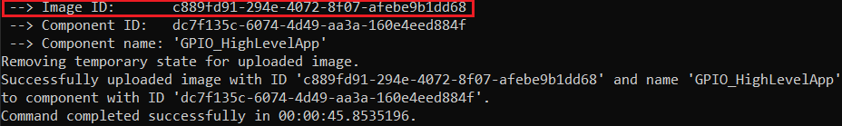
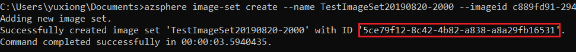
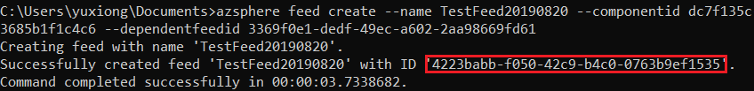

# Lab-2: Application Over-the-Air deployment

- Go to [Home Page](README.md)

## Goals

- Learn how to configure WiFi network for Azure Sphere
- Learn how to use Azure Sphere utility to deploy an application Over-the-Air
- Understand all the concepts in Over-The-Air deployment
  
## Steps 

1. Configure the WiFi SSID and Password and allow Azure Sphere to connect Azure Sphere Security Service.
   
   `azsphere device wifi add --ssid <yourSSID> --key <yourNetworkKey>`
   
   > - To add an open network, omit the --key flag
   > - If your network SSID or key has embedded spaces, enclose in quotation marks, e.g. --ssid "My iPhone"

2. Check WiFi status and confirm it is connnected to the AP.
   
   `azsphere device wifi show-status`

    
    
3. Create a *product SKU* and assign an unique name, record the GUID for later use. The description parameter is optional. 

   `azsphere sku create --name <sku-name> --description <optional-desc>`
   
4. Create a *device group* and assign an unique name, record the GUID for later use. This device group has a default policy that will accept all updates from the Azure Sphere Security Service (Both OS and App)

    `azsphere device-group create --name <device-group-name>`

5. Attach SKU to the device and assign the device to the device group. In the meantime, the following command will delete existing applications and disable debug capability. Now device only accept production-siged image from Azure Sphere Security Service (aka AS3). 

    `azsphere device prep-field --skuid <productsku-GUID> --devicegroupid <devgroup-GUID>`

    At this point, you will see previous loaded LED blink application is not working. 

6. Running command `azsphere device show-ota-config` will get the device related information on AS3, record the *chip SKU* for later use.

   

7. After a successful build, Visual Studio package your applicaiton with metadata into a *.imagepackage* file for deployment. Upload it to Azure Sphere Security Service and automatically create the component that represent your specific application by:
   
   `azsphere component image add --autocreatecomponent --filepath <file_path>`

   -  `<file_path>` parameter should be the absoluate path of imagepackage file included in quotation symbol. 
        
        

   - The component ID and name are retreived from the *app_manifest.json* file, since the imagepackage already have this metadata. 
        
        

   Write down the image ID for next-step use. This ID represent your current version of application, it changes for each build. 

    

8. Create a image set link to the image uploaded to AS3. Fill the image GUID found in previous step. The image set name must be unique in current tenant.

    `azsphere image-set create --name <imageset-name> --imageid <image-GUID>`

    > It is a good practice to use current time and data as ending of image-set name, such as ImageSet-GPIOHighLevelApp-2019.08.27.12.00

    Record the image-set GUID for Step. 10 use.
    

9.  Create an application feed target to the SKU set (chip SKU + product SKU) and component identified in prevous steps. 

    `azsphere feed create --name <feed-name> --componentid <component-id> --chipSkuid <chipsku-GUID> --productskuid <productsku-GUID> --dependentfeedid 3369f0e1-dedf-49ec-a602-2aa98669fd61`

    parameter --dependentfeedid specifies the ID of the Azure Sphere OS feed (3369f0e1-dedf-49ec-a602-2aa98669fd61). All application feed must have this dependence.

    Write down the feed GUID for the last two steps.

    

10. Add the feed to the device group.
    
    `azsphere device-group feed add --devicegroupid <devgroup-GUID> --feedid <feed-GUID>`

11. Add the image set to feed to active a deployment. 

    `azsphere feed image-set add --feedid <feed-GUID> --imagesetid <imageset-GUID>`

12. Reset the board and wait few minitues, LED1 will start to blink once depolyment is finished.

13. Once a feed is active, deploy a new image is pretty straightforward. Try to modify your application and run below command, see what happens to your board!

    `azsphere component publish --feedid <feed-GUID> --imagepath <file-path>`

## Read more
- [Azure Sphere OS networking requirements](https://docs.microsoft.com/en-us/azure-sphere/network/ports-protocols-domains)
- [Deloyment basics](https://docs.microsoft.com/en-us/azure-sphere/deployment/deployment-concepts)
- [Link the device to a feed](https://docs.microsoft.com/en-us/azure-sphere/deployment/link-to-feed)
- [Set up a device group for OS evaluation](https://docs.microsoft.com/en-us/azure-sphere/deployment/set-up-evaluation-device-group)