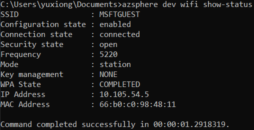

# Lab-2: Application Over-the-Air deployment

- Go to [Home Page](README.md)

## Goals

- Learn how to configure WiFi network for Azure Sphere
- Learn how to use Azure Sphere utility to deploy an application Over-the-Air
- Understand all the concepts in Over-The-Air deployment
  
## Steps 

1. Configure the WiFi SSID and Password and allow Azure Sphere to connect Azure Sphere Security Service.
   
   `azsphere device wifi add --ssid <yourSSID> --psk <yourNetworkKey>`
   
   > - To add an open network, omit the --psk flag
   > - If your network SSID or key has embedded spaces, enclose in quotation marks, e.g. --ssid "My iPhone"

2. Check WiFi status and confirm it is connnected to the AP.
   
   `azsphere device wifi show-status`

    
    
3. Before your devices can receive applications from the cloud, they must have a product and belong to a device group. Create a *product* and assign an unique name, record the GUID for later use. The description parameter is optional. 

   `azsphere product create --name <product-name> --description <optional-desc>`

    By default, each product has five device groups: 

    |  Device Group Name       | App Update  | OS Update | 
    |  ----------------        | ----------  | --------- | 
    | Development              | Disabled    | Retail Evaluation OS |
    | Field Test               | Enabled     | Retail OS |
    | Field Test OS Evaluation | Enabled     | Retail Evaluation OS |
    | Production               | Enabled     | Retail OS |
    | Production OS Evaluation | Enabled     | Retail Evaluation OS |

4. To enable appliation OTA, device must be placed into one specific device group and disable **AppDevelopment** capability (was given by `enable-development` command in Lab-1). Use following command to move current connected device to the 'Field Test' group of selected product.
   
    `azsphere device enable-cloud-test --productname <name of product>`

    At this point, you will see previous loaded LED blink application is not working. 

5. After a successful build of project, Visual Studio package your applicaiton with metadata into a *.imagepackage* file for deployment. You can find it under `out/ARM-Debug-3/` folder in your project root. Record the full path and used in next step.

6. A deployment targets to all device within a device group. Create a deployment to the default Field Test device group of your product by:

    `azsphere device-group deployment create --productname <name of product> --devicegroupname "Field Test" --filepath <path to imagepackage>`

7. Reset the board and wait few minutes, RED LED will start to blink once depolyment is finished.

8. To create a new version of the application and deploy is same as step 6. Every time a new build will generate a different image ID and tracked by AS3. 
    
## Challenge

The RGB LED connect to 3 different GPIO of MT3620. Try to change the color of blinking from RED to GREEN through a new deployment over the air!

> Use chip level abstraction `MT3620_GPIO9` for both MT3620_RDB and AVNET_MT3620_SK board. 

## Read more
- [Connect Azure Sphere to Wi-Fi](https://docs.microsoft.com/en-us/azure-sphere/network/wifi-including-ble)
- [Deloyment basics](https://docs.microsoft.com/en-us/azure-sphere/deployment/deployment-concepts)
- [Create a deployment](https://docs.microsoft.com/en-us/azure-sphere/deployment/create-a-deployment)
- [Applicaiton Manifest](https://docs.microsoft.com/en-us/azure-sphere/app-development/app-manifest)