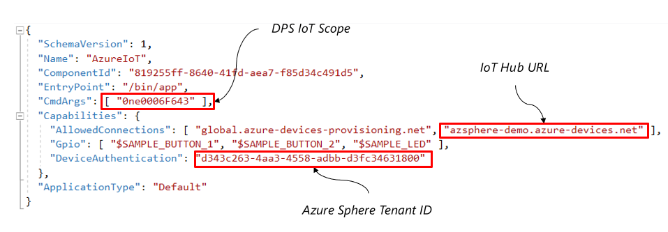
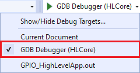
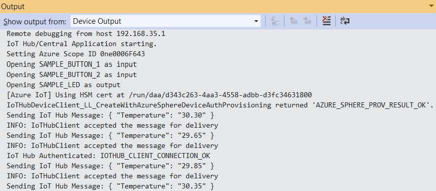
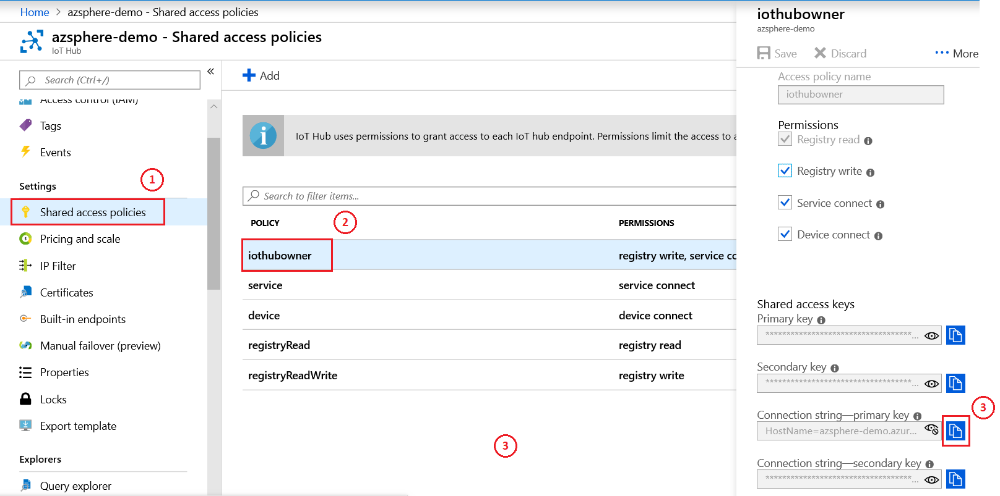
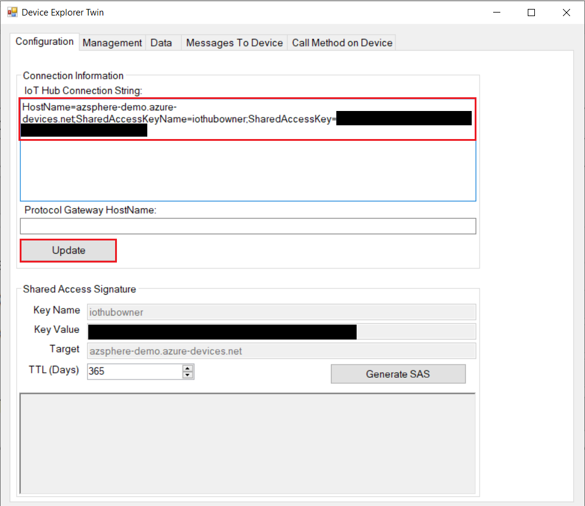
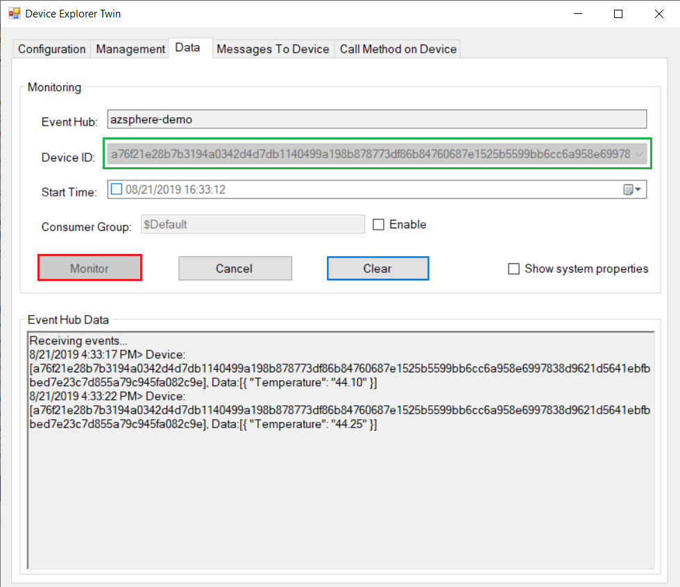
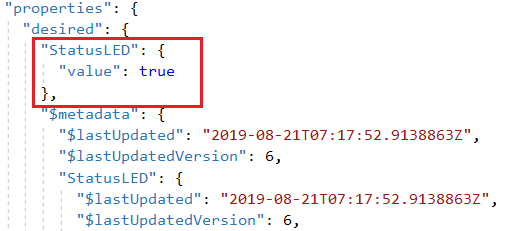
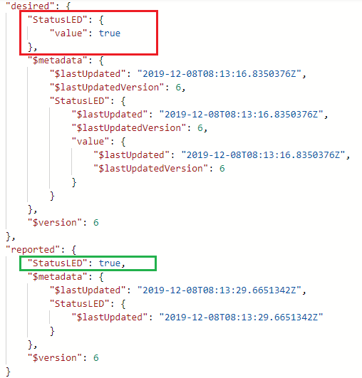

# Lab-3: Connect to Azure IoT Hub

- Go to [Home Page](README.md)

## Goals

- Hands-on with Azure IoT Hub configuration
- Understand how will IoT Hub DPS provision Azure Sphere device
- Understand Azure IoT Hub Device to Cloud message and Device Twin
- Get familiar with the basics of Azure IoT C device SDK API

## Steps

1. Follow [Setup IoT Hub](https://docs.microsoft.com/en-us/azure-sphere/app-development/setup-iot-hub) page to setup cloud resources, the key steps are:
    
    - Create Azure IoT Hub and DPS and link them
    - Upload tenant CA certificate to DPS and finish Proof of Procession
    - Add a enrollment group in DPS to provision Azure Sphere devices

> Azure IoT Hub DPS service do not allow to use free subscription, You should use a pay-as-you-go subscription for this lab. 

1. After connect hardware to your PC, enable device debug and disable OTA in Azure Sphere utility by:
   
   `azsphere device enable-development`

2. Make sure WiFi credential is configured and Azure Sphere is connected to AP. If Lab-2 is skipped, follow Step 1) and 2) in [Ove-The-Air upgrade](Lab-2.md) to setup.

3. Open AzureIoT project in *.\azure-sphere-samples\Samples\AzureIoT* folder. If you're using **AVNET_MT3620_SK** board, follow Step 4 in [Lab-1](Lab-1.md) to modify hardware definition file first.
   
4. Before build the project, there're three key information you need provide to the applicaton in app_manifest.json file.
   
   1. The Tenant ID for your Azure Sphere device
   2. The Scope ID for your device provisioning service (DPS) instance
   3. The Azure IoT Hub URL for your IoT hub
   
   
   
   This [link](https://github.com/Azure/azure-sphere-samples/blob/master/Samples/AzureIoT/IoTHub.md#configure-the-sample-application-to-work-with-your-azure-iot-hub) provides your information about how to get these information

   > IMPORTANT! DON'T delete the exisiting DPS global endpoint: global.azure-devices-provisioning.net in AllowedConnections

5. Select **GDB Debugger (HLCore)** as debug target and press **F5** to start build and load target application onto device for debugging. 
   
   
   
6. You will observer local debug logs showing device is sending simulated telemetry data to IoT Hub after a successful connection. 
   
   

    > Azure IoT Hub is the core PaaS that enable reliable and secure bidirectional communications between millions of IoT devices and a cloud solution. It exposes service API for user to integrate your own business backend for data analystic, storage and show. In this Lab, we will use a tool called **Device Explorer Tool** to simulate an user application to sink data and control IoT device.

7. Download and install [Azure IoT Explorer.msi](https://github.com/Azure/azure-iot-explorer/releases/download/v0.10.9/Azure.IoT.explorer.0.10.9.msi), the latest cross-platform management tool for Azure IoT platform

8. Go to your IoT Hub portal and find the iothubowner policy's connection string under **shared access policies** setting, click the icon to copy.
   
   

9.  Open **Azure IoT Explorer** and paste connection string to the dialog, click **update** to get access to IoT Hub. 
   
   

11. Select the connected device and go to *Telemetry* tab, click **Start** to read telemetry from the build-in endpoint of IoT Hub
   
   

12. In sample code, the LED5 is controlled by Device Twin mechanism. Go to *Device Twin* tab you will see the whole twin document on the cloud. In Device Twin window, add a property `"StatusLED":{"value":true}` under the `"desired"` property and remove all other key-value. Then click **Save** button to update the Device Twin. Your device will be notified for this property change and light LED5 on board accordingly. 
    
    

13. User can click **Refresh** button to get the updated twin document. In `"reported"` seciton you will observe the status reported by device. 

    

## Read more
- [Azure Sphere Application Manifest](https://docs.microsoft.com/en-us/azure-sphere/app-development/app-manifest)
- [Provisioning device with Azure IoT Hub DPS](https://docs.microsoft.com/en-us/azure/iot-dps/about-iot-dps)
- [IoT Hub D2C message](https://docs.microsoft.com/en-us/azure/iot-hub/iot-hub-devguide-messages-d2c)
- [IoT Hub Device Twin](https://docs.microsoft.com/en-us/azure/iot-hub/iot-hub-devguide-device-twinsp)
- [Azure IoT C SDK](https://github.com/Azure/azure-iot-sdk-c)