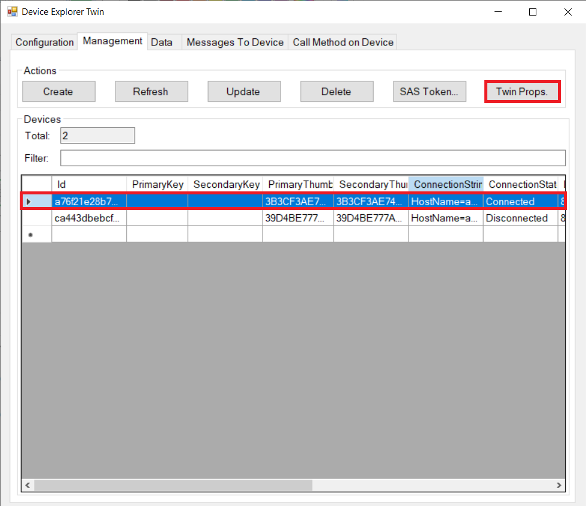

# Lab-3: Connect to Azure IoT Hub

- Go to [Home Page](README.md)

## Goals

- Hands-on with Azure IoT Hub configuration
- Understand how will IoT Hub DPS provision Azure Sphere device
- Understand Azure IoT Hub Device to Cloud message and Device Twin
- Get familiar with the basics of Azure IoT C device SDK API

## Steps

1. Follow [Setup IoT Hub](https://docs.microsoft.com/en-us/azure-sphere/app-development/setup-iot-hub) page to setup cloud resources, the key steps are:
    
    - Create Azure IoT Hub and DPS and link them
    - Upload tenant CA certificate to DPS and finish Proof of Procession
    - Add a enrollment group in DPS to provision Azure Sphere devices

> Azure IoT Hub DPS service do not allow to use free subscription, You should use a pay-as-you-go subscription for this lab. 

1. After connect Azure Sphere development board to your PC, enable device debug and disable OTA in Azure Sphere utility by:
   
   `azsphere device prep-debug`

2. Make sure WiFi credential is configured and Azure Sphere is connected to AP. If Lab-2 is skipped, follow Step 1) and 2) in [Ove-The-Air upgrade](Lab-2.md) to setup.

3. Open a solution in Visual Studio and navigate to the folder of *.\azure-sphere-samples\Samples\AzureIoT*, open AzureIoT.sln solution file. Before build the project, there're three key information you need provide to the applicaton in app_manifest.json file.
   
   1. The Tenant ID for your Azure Sphere device
   2. The Scope ID for your device provisioning service (DPS) instance
   3. The Azure IoT Hub URL for your IoT hub
   
   
   
   This [link](https://github.com/Azure/azure-sphere-samples/blob/master/Samples/AzureIoT/IoTHub.md#configure-the-sample-application-to-work-with-your-azure-iot-hub) provides your information about how to get these information

   > IMPORTANT! DON'T delete the exisiting DPS global endpoint: global.azure-devices-provisioning.net in AllowedConnections

4. You will observer logs showing device is sending simulated telemetry data to IoT Hub after a successful connection. 
   
   

    > Azure IoT Hub is the core PaaS that enable reliable and secure bidirectional communications between millions of IoT devices and a cloud solution. It exposes service API for user to integrate your own business backend for data analystic, storage and show. In this Lab, we will use a tool called **Device Explorer Tool** to simulate an user application to sink data and control IoT device.

5. Download and install [DeviceExplorer.msi](https://github.com/Azure/azure-iot-sdk-csharp/releases/download/2019-1-4/SetupDeviceExplorer.msi), a tool write in C# and Azure IoT Service SDK for C#.

6. Go to your IoT Hub portal and find the iothubowner policy's connection string under **shared access policies** setting, click the icon to copy.
   
   

7. Open **DevcieExplorer** and paste connection string to the dialog, click **update** to get access to IoT Hub. 
   
   

8. Go to *Data* tab, ensure the right device is selected and click **Update** button to start monitoring D2C message from device
   
   

9.  Cloud to device control is implemented through the Device Twin mechanism in this lab. Go to *management* tab and select your device in the tab, click **Twin Props** button will open the Device Twin window.

    

10. In Device Twin window, add a property `"StatusLED":{"value":true}` under the `"desired"` property and click **Send (use Json format)** button to update the Device Twin. Your device will be notified for this property change and light LED1 on board accordingly.  
    
    

## Challenge

Add your own (any) attribute in Device Twin and use it to control the LED2's BLUE ON and OFF.

> BLUE color of LED2 is connected to GPIO17 and has a name SAMPLE_RGBLED_BLUE defined in hardware definition file.

## Read more
- [Azure Sphere Application Manifest](https://docs.microsoft.com/en-us/azure-sphere/app-development/app-manifest)
- [Provisioning device with Azure IoT Hub DPS](https://docs.microsoft.com/en-us/azure/iot-dps/about-iot-dps)
- [IoT Hub D2C message](https://docs.microsoft.com/en-us/azure/iot-hub/iot-hub-devguide-messages-d2c)
- [IoT Hub Device Twin](https://docs.microsoft.com/en-us/azure/iot-hub/iot-hub-devguide-device-twinsp)
- [Azure IoT C SDK](https://github.com/Azure/azure-iot-sdk-c)