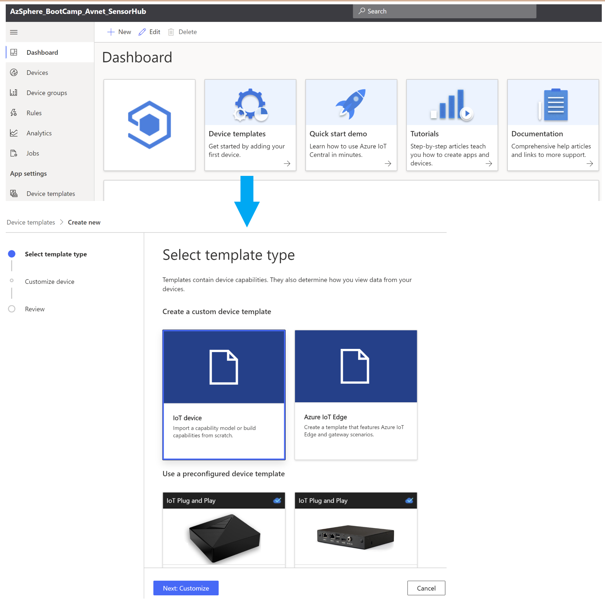
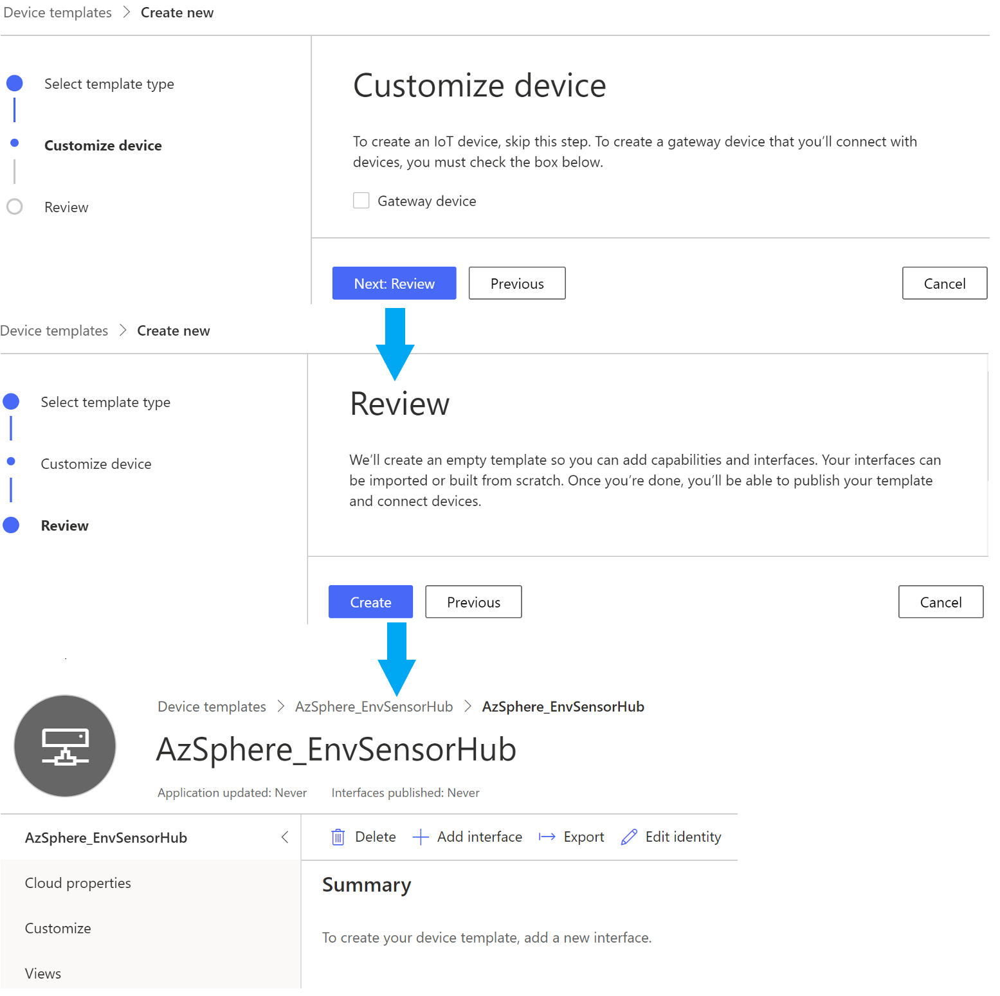
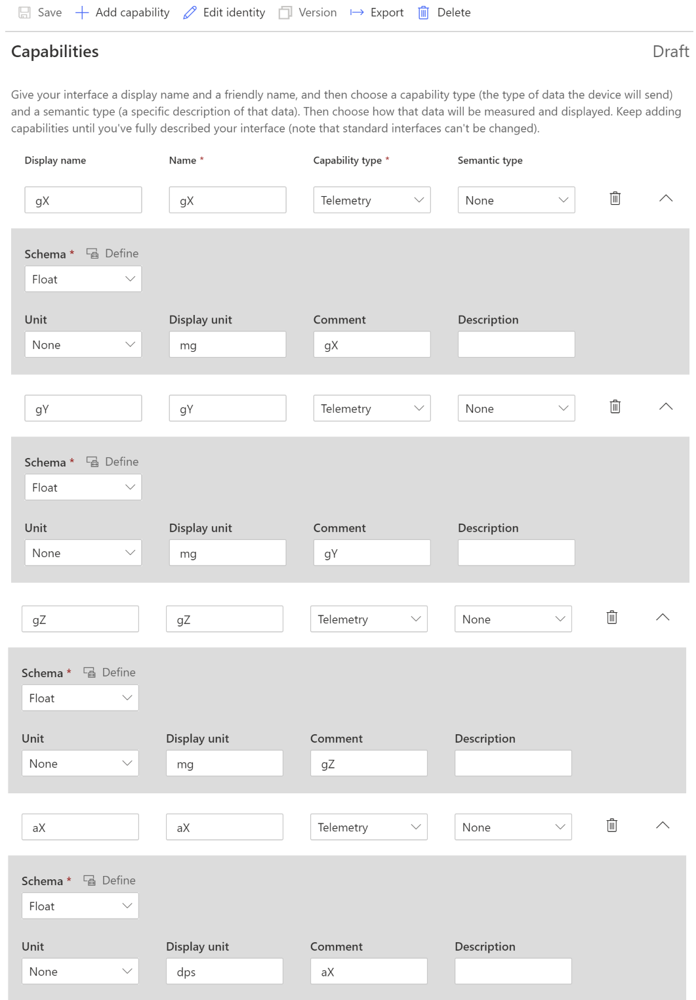
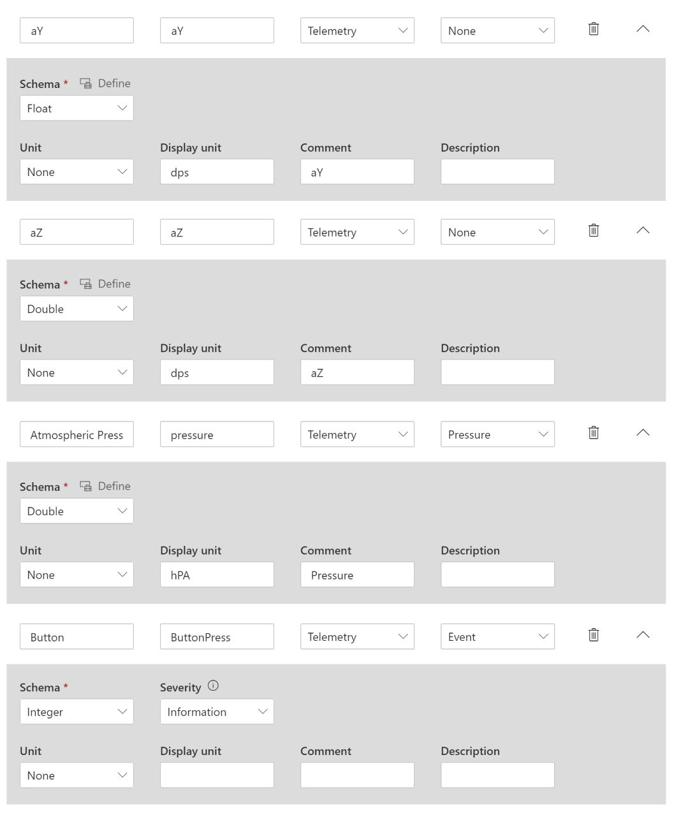
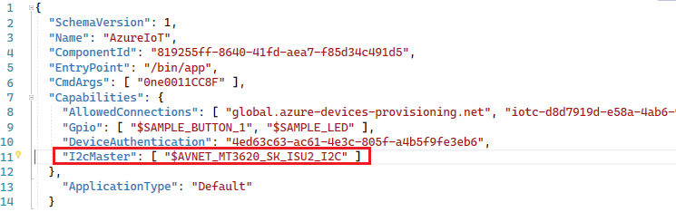
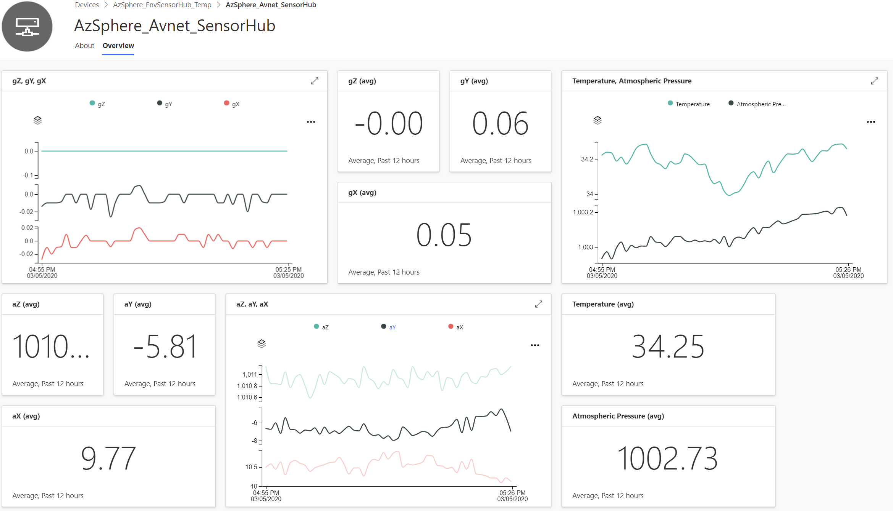

# Lab-4: Visualize Telemetry Data on Azure IoT Central

- Go to [Home Page](README.md)

## Goals

- Hands-on with Azure IoT Central configuration
- Understand the basic feature of IoT Central offered as a IoT SaaS solution
- Get familiar with I2C API to connect to external sensor device
- Use Azure Sphere and Azure IoT Central work together to build a secured end-to-end solution with telemtery collection, visulization and remote control ability.
- This lab comprises of two parts: -
	- Azure Sphere Pre-defined Sample Device Template for simulated data visualization
	- Creating your own custom template to visualize real world data 

## Setup Steps

1. After connect Azure Sphere development board to your PC, enable device debug and disable OTA in Azure Sphere utility
   
   `azsphere device enable-development`

2. Make sure WiFi credential is configured and Azure Sphere is connected to the WiFi Access Point. If Lab-2 is skipped, please follow Step 1) and 2) in [Over-The-Air upgrade](lab-2.md) to configure the WiFi.
   
3. Please follow the following link [Setup IoT Central](https://docs.microsoft.com/en-us/azure-sphere/app-development/setup-iot-central) to setup the cloud resources, the importants steps are:
    
    - Login to Azure IoT Central with your Azure credentials
	- Create an Azure IoT Central Application
    - Upload tenant CA certificate to IoT Central and finish Proof of Procession

## Azure Sphere Pre-defined Sample Device Template for simulated data visualization

4. Next is to create a device template in IoT Central.  Go to your application in [Azure IoT Central](https://apps.azureiotcentral.com/) and select Device Templates page under the application section.  Please go to the link and follow the example guide on how to use the [Azure IoT Central pre-defined template - Azure Sphere Sample Device Template](https://github.com/Azure/azure-sphere-samples/blob/master/Samples/AzureIoT/IoTCentral.md#configure-the-azure-iot-central-application).

## Creating your own custom template to visualize real world data

5. After working with pre-defined template and visualizing simulated telemetry data, now let's move on to working with world data visualization where custom template is required here.  In the application section, select Device Templates to create a custom device template by choosing the **IoT Device** as a start.

	

6. Click **Next: Customize** and in the next page, leave the **Gateway device** unchecked; click on **Next: Review** --> finally **Create** the custom template.  Enter a name for your template, such as **Sensor Hub**.

	

7. You also need to create a device capability model and add a set of custom interface for your device.  Make use of the telemetry data to tabulate the device capabilities and the associated interfaces.  
	
	Alternatively you may import an existing device capability model template, i.e. [azsphere-bc-avnet-sensorhub.json](code/Lab-4/answer)

	In order to build one, please see the following example. Start by click `Add Interface` then `Add Capabilitity`

	> **IMPORTANT:** The field *Name* are case sensitive, please ensure you follow the input format of telemetry data name parameter,
	
	
	
	

8. **Save** to 

9.  **Save** capability definition and go to **Views**. You may use the general default view or add your own customization and selecting the various dashboard views. Azure IoT Central provide high flexibility and front UI element for your to visualize data. 
    
10. Before you can connect a device that implements your device capability model, you must publish your device template.  To publish a device template, go to you your device template, and select **Publish**.

11. After you had published your newly created template, its time to migrate the existing device to the new template. On the left hand side of the navigation pane, select **Devices** and then choose the device(s) that you want to migrate, then click **Migrate**.  Please select the target template that you intend to migrate to.  **Migrate** will now associate the Device with the device template that was just created / published. Once you have done associating it, the Device Status will show as **Provisioned**.

12. Before proceed to building the project, we need to modify several files and adding new source codes 
	
	- Please download the [MEMS Sensors (LSM6DSO and LPS22HH) and I2C driver](code/Lab-4/sensorhub_lsm6ds0_lps22hh) source / header files and copy into the project folder root directory (*.\azure-sphere-samples\Samples\AzureIoT*).
	- Please update the CMake list file ("CMakeLists.txt") to add i2cDevice.c, lps22hh_reg.c and lsm6dso_reg.c to the `ADD_EXECUTABLE` parameter. 
	- Follow Step 4 in [Lab-1](lab-1.md) to modify target hardware definition file since this lab is based on AVNET_MT3620_SK
	- Grant ISU2 I2C access permission to application in app_manifest.json
	
	  
		 
	- Last but not least, you will need to make changes to the code to visualize your real world data by 
	
		- Iniitializing the I2C Driver and Sensor Hub during peripheral initialization.

            > **HINT:** `#include "i2cDevice.h"` and call `initI2cDevice` function during initialization
  
		- Replacing the functions that send simulated data with the Sensor Hub API to send live telemetry data to IoT Central.
				
			> **HINT:** replace `SendSimulatedTelemetry` by `SensorHub_SendData()` in loop

        - Remove `static` scope for variable `iothubClientHandle` to let other file access for simplicity.
		
	- **NOTE:** Alternatively, the answers are prepared in git patches. You can apply the following patches: -  		
		
		- [0001-Add-I2C-and-Sensor-Drivers.patch](code/Lab-4/answer): Contains the source codes of the I2C driver and on-board MEMS Sensors (LSM6DSO and LPS22HH)
		- [0002-AzSphere_Tutorial-Lab-4-Answers.patch](code/Lab-4/answer): Answer to the actual changes.  
		
        - Please copy the patches (\*.patch) into the project folder root directory (*.\azure-sphere-samples\Samples\AzureIoT*) and use the following git command to apply a patch
		
    		- Apply a git patch: `git apply <patch_file>` 
			
			    *(Begin applying 0001... then 0002...)*
			
    		- Study the code changes: `git diff`

11. After finishing all the configuration and code changes, please make sure you perform a clean build.  Select **GDB Debugger (HLCore)** and Press F5 to build and run the application. 

12. Go to the device dashboard to check your data.

    
	

## Read more

- [What is Azure IoT Central](https://docs.microsoft.com/en-us/azure/iot-central/overview-iot-central)
- [Azure IoT Central Architecture](https://docs.microsoft.com/en-us/azure/iot-central/concepts-architecture)
- [Defining new IoT device template in Azure Central](https://docs.microsoft.com/en-us/azure/iot-central/core/howto-set-up-template)
- [Use I2C with Azure Sphere](https://docs.microsoft.com/en-us/azure-sphere/app-development/i2c)
- [Manage target hardware dependencies](https://docs.microsoft.com/en-us/azure-sphere/app-development/manage-hardware-dependencies)

