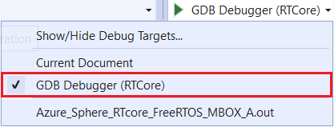

# Lab-5: Real-time core Application Programming

- Go to [Home Page](README.md)

## Goals

- Understand the basic element of Azure Sphere Real-time Application
- Get familiar with basic GPIO API
- Get familiar with Azure RTOS task, event group and semaphore API
- Get familiar with inter-core communication 

## Steps

1. Enable real-time core device debug by openning Azure Sphere utility as Administrator.
   
   `azsphere device enable-development --enablertcoredebugging`

2. Clone Azure RTOS on Azure Sphere M4 sample code repo.

    `git clone https://github.com/xiongyu0523/Azure-RTOS-on-Azure-Sphere-Mediatek-MT3620`

### Running a basic Azure RTOS real-time application

3. Open Visual Studio, select **Open a local folder** in Visual Studio and navigate to above folder, click **Select Folder** to open the CMake project.

    > This project is a simple demo to show how to use Azure RTOS event group to synchronize two tasks and toggle a LED by using MT3620 GPIO driver API from Mediatek. 

4.  Select **GDB Debugger (RTCore)** as debug target and press **F5** to start build and load target real-time application onto device. You will observe LED is blinking at 1Hz rate (500ms ON / 500ms OFF). 

    

5. Code Walkthrough...

### Add intercore communication 

5. Copy intercore communication code from *.\Azure-Sphere-Bootcamp\code\Lab-5* to Azure RTOS demo project's *demo_threadx* folder. Then add `./demo_threadx/logical-intercore.c` and `./demo_threadx/mt3620-intercore.c` to build target function `add_executable` in root CMakeLists.txt file.

    > The intercore driver is from official sample code repo with small modification to work within a RTOS environment

6. In `demo_threadx.c` file, doing follow soure code changes
   
    - Add two include path for new intercore communication driver
  
        ```
        #include "logical-intercore.h"
        #include "mt3620-intercore.h"
        ```

    - Define task, semaphore and IntercoreComm object
  
        ```
        TX_SEMAPHORE            semaphore_0;
        TX_THREAD               thread_2;
        IntercoreComm icc;
        ```

    - create task and semaphore instances at the end of `tx_application_define` function
  
        ```
        tx_byte_allocate(&byte_pool_0, (VOID**)&pointer, DEMO_STACK_SIZE, TX_NO_WAIT);

        tx_thread_create(&thread_2,
            "thread 2",
            thread_2_entry,
            0,
            pointer,
            DEMO_STACK_SIZE,
            3,
            3,
            TX_NO_TIME_SLICE,
            TX_AUTO_START);

        tx_semaphore_create(&semaphore_0, "semaphore 0", 0);
        ```

    - Implement function `HandleReceivedMessageDeferred` to handle data receiving and print on UART

        ```
        void HandleReceivedMessageDeferred(void)
        {
            for (;;) {
                ComponentId sender;
                uint8_t rxData[32];
                size_t rxDataSize = sizeof(rxData);

                IntercoreResult icr = IntercoreRecv(&icc, &sender, rxData, &rxDataSize);

                if (icr == Intercore_Recv_NoBlockSize) {
                    return;
                }

                if (icr != Intercore_OK) {
                    printf("IntercoreRecv: %d\r\n", icr);
                    return;
                }

                printf("Message size: %d bytes\r\n", rxDataSize);
                printf("Message content is %s\r\n", &rxData[0]);
            }
        }
        ```

    - Implement function `thread_2_entry` taks to block on trigger signal and call above `HandleReceivedMessageDeferred` to deal with data. At the end, set BIT1 of event group flag. 
  
        ```
        void thread_2_entry(ULONG thread_input)
        {
            printf("thread 2 start\n");
            UINT    status;

            while (1) {
                status = tx_semaphore_get(&semaphore_0, TX_WAIT_FOREVER);
                if (status != TX_SUCCESS) {
                    printf("tx_semaphore_get fail\n");
                    break;
                }

                HandleReceivedMessageDeferred();
                tx_event_flags_set(&event_flags_0, 0x2, TX_OR);
            }
        }
        ```
    - implement function `Notify` to pass to intercore driver to post a semphore when A7 core send a message to M4 core.

        ```
        void Notify(void)
        {
            UINT status;

            status = tx_semaphore_put(&semaphore_0);
            if (status != TX_SUCCESS) {
                printf("tx_semaphore_put fail\n");
            }
        }
        ```
    
    - Call `SetupIntercoreComm(&icc, Notify)` function in `tx_application_define` function to initailize intercore communication and register a signaling callback. 

    - Modify event group flag in `thread_1_entry` task to wait for both BIT0 and BIT1. So LED will be toggled only when both flag arrive
        ```
        status = tx_event_flags_get(&event_flags_0, 0x3, TX_AND_CLEAR,
                                    &actual_flags, TX_WAIT_FOREVER);
        if ((status != TX_SUCCESS) || (actual_flags != 0x3)) {
            printf("tx_event_flags_get fail\n");
            break;
        }                                     
        ```

7. Open another Visual Studio instance, select **Open a local folder** and then navigate to *.\azure-sphere-samples\Samples\IntercoreComms\IntercoreComms_HighLevelApp*, click **Select Folder** to open the CMake project.

    > This project is the official demo to show how to do inter-core communication on high-level application. It sends a message to real-time core every seconds. 

8.  In **real-time application** project, do the following changes to trust and partner with high-level application

    - In **app_manifest.json**, add new field **AllowedApplicationConnections** and assign high-level application component id `25025d2c-66da-4448-bae1-ac26fcdd3627` to it. This gives real-time application proper access right.

    - In **launch.vs.json**, fill the value of **partnerComponents** item to the high-level application component id `25025d2c-66da-4448-bae1-ac26fcdd3627`. This prevents visual studio to remove loaded app as a [parnter application]([partnerComponents](https://docs.microsoft.com/en-us/azure-sphere/app-development/applications-overview#partner-applications))


9.  Also in **high-level application** project, do the following changes to trust and partner with above real-time application
    
    - In **main.c**, override the value of **rtAppComponentId** array to the real-time application component id `8bad3ffb-ba15-4b81-9acb-0cc5bf5cfa2d`. This value is used to create application socket to talk to a speicific application running on rt core. 

    - In **app_manifest.json**, override the value of **AllowedApplicationConnections** item to the real-time application component id `8bad3ffb-ba15-4b81-9acb-0cc5bf5cfa2d`. This gives high-level application proper access right.

    - In **launch.vs.json**, override the value of **partnerComponents** item to the real-time application component id `8bad3ffb-ba15-4b81-9acb-0cc5bf5cfa2d`. This prevents visual studio to remove loaded app as a [parnter application]([partnerComponents](https://docs.microsoft.com/en-us/azure-sphere/app-development/applications-overview#partner-applications))

10. First start real-time application debug and then start high-level application debug. You will observe red LED is not blinking when you only load the real-time application and it begins to blink when high-level application is running. The blink rate is adjusted to 2Hz (1s ON / 1s OFF) to align with message push rate from high-level application. You can also observe log in high-level application.
    ```
    Remote debugging from host 192.168.35.1, port 64451
    High-level intercore application.
    Sends data to, and receives data from the real-time core.
    Sending: Hello-World-0
    Sending: Hello-World-1
    Sending: Hello-World-2
    Sending: Hello-World-3
    Sending: Hello-World-4
    Sending: Hello-World-5
    ...
    ```

## Read more
- [Communicate with a real-time capable application](https://docs.microsoft.com/en-us/azure-sphere/app-development/high-level-inter-app)
- [Overview of real-time capable application development](https://docs.microsoft.com/en-us/azure-sphere/app-development/rt-app-development-overview)
- [CodeThink MT3620 drivers](https://github.com/CodethinkLabs/mt3620-m4-drivers)
- [Mediatek MT3620 drivers](https://github.com/MediaTek-Labs/mt3620_m4_software)
- [Azure RTOS GitHub](https://github.com/azure-rtos/)
