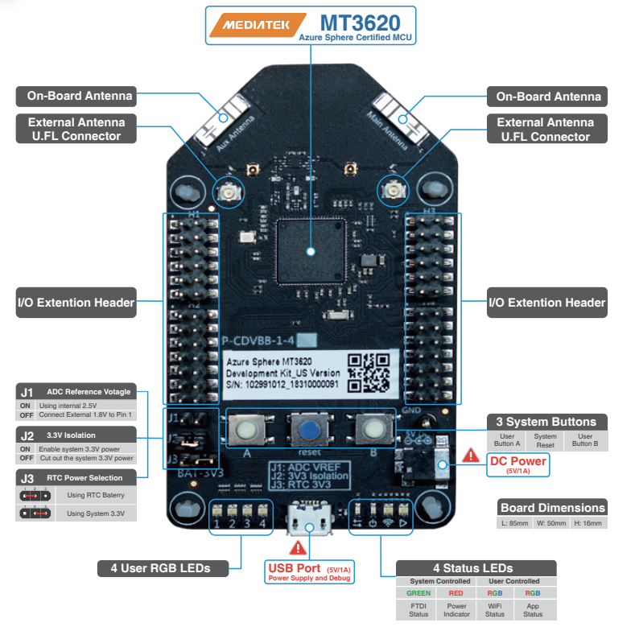
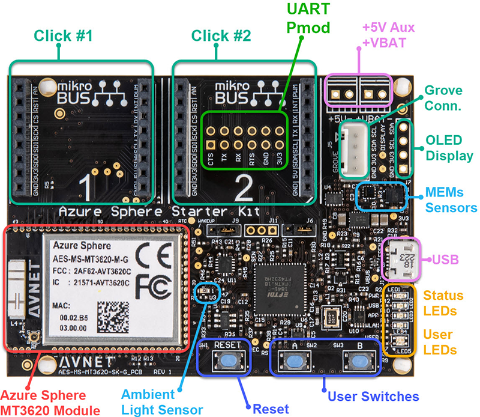
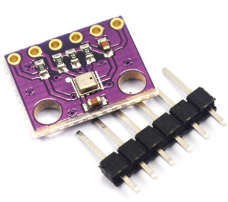

# Azure-Sphere-Bootcamp

This repo is built for Azure Sphere Bootcamp Hands-on day. It provides all required information for trainee to follow and finish all hands-on labs. 

# Pre-Lab prerequisites

Follow [Get started with a development kit](https://docs.microsoft.com/en-us/azure-sphere/install/overview) to complete all neccessary steps before start.

> All hands-on and setup are based on Windows and Visual Studio. Linux and VS Code are not used for this bootcamp

Quick check list:
- FTDI driver is installed and three COMx ports are present in Device Manager 
- Up to date Visual Studio and Azure Sphere SDK Preview for **Visual Studio** are installed
- Has a Microsoft account
- Has a Azure account and a free subscription or pay-as-you-go subscription for Lab-3 and Lab-4
- Has logged in Azure Sphere command line utility by `azsphere login` or `azsphere login --newuser <MS account>` when you're not registered/login before.
- Device is recovered by `azsphere device recover`
- Create a Azure Sphere tenant by `azsphere tenant create -n <tenant name>` if there is no tenant in your orgnization.
- Has selected Azure Sphere tenant by `azsphere tenant select -i <tenant id>`
- (New device ONLY) Device is claimed to user's tenant by `azsphere device claim`
- Device is recovered by `azsphere device recover` command to have a knowning good Azure Sphere OS.
- [Git](https://git-scm.com/download/win) is installed and added to PATH.

# Hardware

The hands-on can be used with both MT3620_RDB and AVNET_MT3620_SK. 

## MT3620_RDB

Detaled information about this hardware can be found on [azure-sphere-hardware-designs](https://github.com/Azure/azure-sphere-hardware-designs)

## AVNET_MT3620_SK

Detaled information about this hardware can be found in this [community](https://www.element14.com/community/community/designcenter/azure-sphere-starter-kits)

## BME280 sensor board

To complete Lab-4, a BME280 sensor board is required. The board can be bought from [Alibaba](https://item.taobao.com/item.htm?spm=a1z2k.11010449.931864.2.5bb0509difTEbj&scm=1007.13982.82927.0&id=588033650584&last_time=1575801256). 

 

> If you're using AVNET_MT3620_SK and do not have a sensor board, you can refer to Step 16 in [Lab-4](Lab-4.md) to use on-board accelemeter, gyrometer and pressure sensors. 

# Labs

- [Lab-1 Blinking LED](Lab-1.md)
- [Lab-2 Application Over-the-Air deployment](Lab-2.md)
- [Lab-3 Connect to Azure IoT Hub](Lab-3.md)
- [Lab-4 Visualize real world data on Azure IoT Central](Lab-4.md)

# Sample Code Disclaimer

**Sample code – No Warranties**
THE SAMPLE CODE SOFTWARE IS PROVIDED “AS IS” AND WITHOUT WARRANTY. TO THE MAXIMUM EXTENT PERMITTED BY LAW, MICROSOFT DISCLAIMS ANY AND ALL OTHER WARRANTIES, WHETHER EXPRESS OR IMPLIED, INCLUDING, BUT NOT LIMITED TO, ANY IMPLIED WARRANTIES OF MERCHANTABILITY, NON-INFRINGEMENT, OR FITNESS FOR A PARTICULAR PURPOSE, WHETHER ARISING BY A COURSE OF DEALING, USAGE OR TRADE PRACTICE OR COURSE OF PERFORMANCE. In no event shall Microsoft, its licensors, the authors or copyright holders be liable for any claim, damages or other liability, whether in an action of contract, tort or otherwise, arising from, out of or in connection with the software or the use thereof. 
 
This code may contain errors and/or may not operate correctly. Microsoft undertakes no duty to correct any errors or update the software. Your use of this code is optional and subject to any license provided therewith or referenced therein, if any. Microsoft does not provide you with any license or other rights to any Microsoft product or service through the code provided to you.
